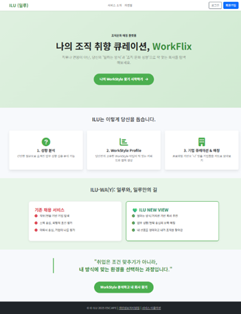

## `ILU (일루) - 고객 가치 기반 회사 추천 서비스` 프로젝트

## 도메인 - `자유`

## 팀 소개
- **팀장**: `김지윤`
- **팀원**: `정재우`

## 프로젝트 개요
**ILU**는 직무나 연봉이 아닌, **‘일하는 방식과 조직문화’** 를 기준으로 회사를 탐색하는 서비스입니다. 사용자는 성향 진단을 통해 자신에게 적합한 조직 문화적 특성을 가진 회사를 추천받을 수 있습니다. 이 서비스는 고객의 가치를 최우선으로 고려하며, 사용자의 성향에 맞는 회사 추천을 제공합니다.

- **서비스 이름**: ILU (일루: 고객 가치 기반 회사 추천 서비스)
- **서비스 개요**: 사용자의 성향을 분석하고, 이에 맞는 조직 문화적 특성을 가진 회사를 추천합니다.

### 주요 페이지 구성
- **메인 페이지**: ILU 서비스에 대한 소개 및 기능 안내 페이지
- **성향 분석 페이지**: 사용자가 자신의 성향을 분석할 수 있는 페이지
- **결과 도출 페이지**: 성향 분석 결과를 보여주는 페이지
- **마이 페이지**: 사용자 맞춤형 정보 및 성향 프로파일 관리 페이지
- **기업 상세 분석 페이지**: 추천된 기업에 대한 상세 정보 페이지
- **리뷰 작성 페이지**:
  - **index**: 리뷰 목록을 확인할 수 있는 페이지
  - **create**: 기업 리뷰를 작성할 수 있는 페이지
  - **detail**: 작성된 리뷰의 상세 보기 페이지

### 메인 페이지 초안

### 현재 진행상황
- 기획
- 데이터셋 설정
